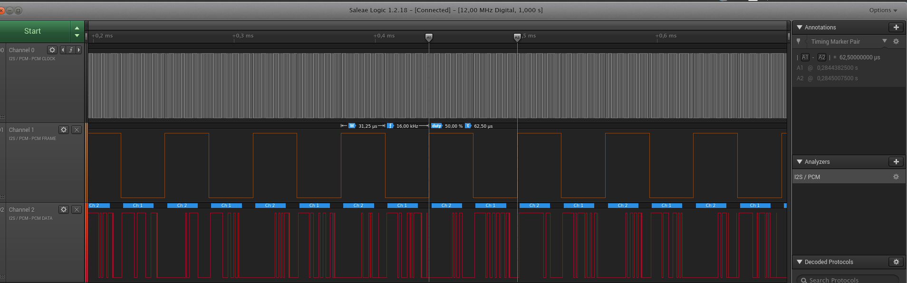

## RP2040 Dictaphone

Prototype of digital dictaphone, based on 
* **MCU** - RP2040
* **Microphone** - INMP441 x2 for stereo input
* SD card

You can turn on and off recording by pressing on button and with UART commands

* Short button press or `start` in UART - to start record
* Long press ( > 1 sec ) or `stop` in UART - to stop record

Sample rate 16kHz



## Build with

* [PICO-SDK](https://github.com/raspberrypi/pico-sdk)
* [no-OS-FAT-FS](https://github.com/carlk3/no-OS-FatFS-SD-SPI-RPi-Pico.git)

## How to build

```shell
# Clone with submodules
git clone --recurse-submodules https://github.com/VladiAron/RP2040-Dictophone.git
cd RP2040-Dictophone
# Set environment variables to download SDK 
export PICO_SDK_FETCH_FROM_GIT=ON
export PICO_SDK_FETCH_FROM_GIT_PATH= # Location to download SDK
# Or you can download it manualy from git and set PICO_SDK_PATH 
git clone https://github.com/raspberrypi/pico-sdk.git
export PICO_SDK_PATH= # path to your downloaded sdk

# Setup build with cmake
mkdir build
cd build 
cmake ..

# Build all targets
make 
```

